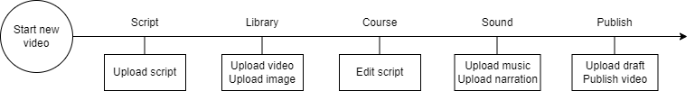

# Decentralized Storage for VideoWiki
The main goal of this repository is decentralizing the storage of the information generated on the VideoWiki platform. 
There are different kinds of information that the user generates during the video creation process.



The development of the project will be divided in 4 different blocks.

1. Decentralize the draft storage (video composition)
2. Decentralize the storage of the uploaded media
3. Decentralize the storage of the final video
4. Implementation of the fork protocol to VideoWiki (public videos fork, private videos fork, authorship assessment and retributions)

## Decentralize the draft storage

**Goal:** The goal of this block is to store and retrieve the json file information of the video we are editing directly from Swarm.

**Steps:**
- [ ] Prepare to connect to Swarm node
- [ ] Get user information and draft from VideoWiki (Eth address)
- [ ] Define data structure
- [ ] Store draft on Swarm
- [ ] Retrieve draft from Swarm
- [ ] Define API to send draft to VideoWiki

## Decentralize the storage of the uploaded media

**Goal:** The goal of this block is to store and retrieve the uploaded media (images, videos and audios) from Swarm.

**Steps:**
- [ ] Define use case and decide whether to use Fairdrive or Swarm directly.
- [ ] Get the media from VideoWiki (Eth address)
- [ ] Define data structure
- [ ] Store media on Swarm
- [ ] Use media URL on the video structure

## Decentralize the storage of the final video

**Goal:** The goal of this block is to store and retrieve the final video from Swarm.

**Steps:**
- [ ] Define use case and decide whether to use Fairdrive or Swarm directly.
- [ ]


## API Definition

| Endpoint          | Method | Description                                                                                                                                                                                        |
|-------------------|--------|----------------------------------------------------------------------------------------------------------------------------------------------------------------------------------------------------|
| api/safeDraft     | Post   | Post a json structure and stores it on the Swarm network*.<br/>Request body:<br/>```{encrypted : bool, data: json} ``` <br/>Response:<br/>```{reference : string, encryptionKey: string?} ```<br/> |
| api/retrieveDraft | Get    | Get a json structure from the Swarm network*.<br/>Request body:<br/>```{reference: string, key: string?} ``` <br/>Response:<br/>```{data: json} ```<br/>                                           |

*Via node hosted in external server


## Tips for developers

Use `bee dev` to run a Swarm development server. It will listen to `localhost:1633` and `localhost:1635`.
